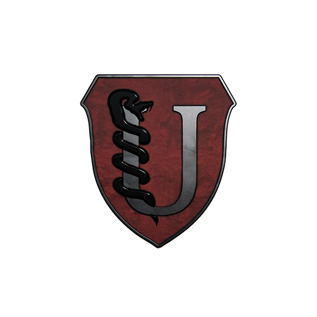

# UDS-FrameWork
# UDS Arma mission framework (COOP)
## Version: 07042022

### Changed

- All base rifle loadouts have 2 extra mags, added more for mg also.
- More medical by default to all playable units.
- Stamina and load coefficient has been altered for more ammo.
- FTL roles now carry more medical equipment.
- Changed FLT ruck from small to medium.
- Moved from Ace to Vanilla spectator.
- Changed respawns to wave (to trial) 5 minute role over.
- Removed 2nd plt medic from compositions.
- Removed ticket respawns from module to in init file.
- Merged Sims’s briefing radio edit pull request.
- Managed to fix the vehicle garage in the editor while using the framework.
- Removed some MAT ammo, because it was still too heavy.
- Changed Spotter roles laser designator to a vector.

### Retro Fitting

- Replace init.sqf
- Replace description.ext
- Replace U3_briefing.sqf
- Replace U3_MissionFramework.VR\scripts\assignGear\assignGear_BLU.sqf
- Replace U3_MissionFramework.VR\scripts\assignGear\assignGear_OPF.sqf
- Replace U3_MissionFramework.VR\scripts\assignGear\assignGear_Functions.sqf
- New compositions file to be used UDS_MissionCompositions_v1_4.VR
